# The Pool Hall

 ### LIVE LINK  [The Pool Hall](https://pp4poolhall-b3360ca06d73.herokuapp.com/)
 ### Link to [github repository](https://github.com/EdelCorbett/the-pool-hall)
 ---
The Pool Hall is an app for member-only Pool Club.The app is a convenient way for members to reserve Pool tables for certin times. Members can log in check table availability, and book their time slot.The app also has an events page where the club can keep members up to date on the Club events and news.
---
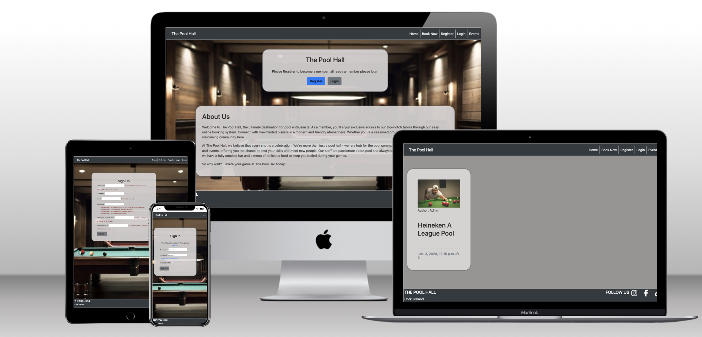

# Strategy

This site is developed for a members only pool hall so that members can register their membership so they a book a table and see what time are available.

---
## Goals
The goal of this site is to build a booking system so staff of the pool hall can manage booking a members can make bookings online.

---
# Agile Methodology
Github projects was use to follow agile principles. Using this help me organise my user stories with acceptance criteria and tasks in to EPICS(milestones), once 1 had created the user stories I then group them in to 5 different Epics 

### [Project Board](https://github.com/users/EdelCorbett/projects/5?pane=issue&itemId=45068334)

The Project board was divided in to 4 columns todo,In progress, done and bugs 

----
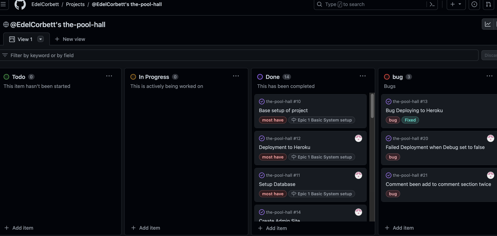

---

MoSCoW Prioritization
In this project MoSCoW was use to prioritize the most important features

### Wireframes
---
| PAGE                  |   Wireframes    |
|-----------------------------|------------|
|  Home          | 

image
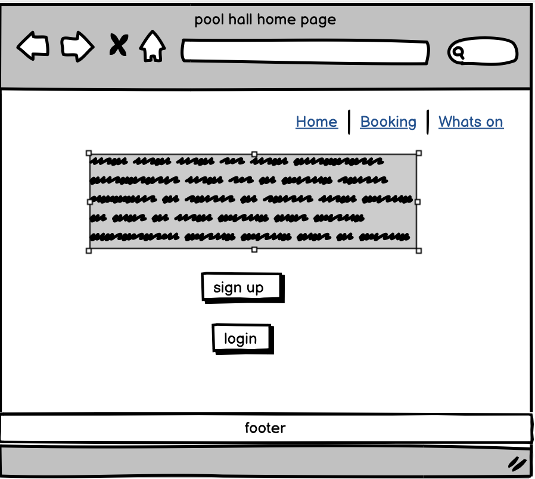
 | 
|  Booking          | 

image

 | 
|  Sign up /register          | 

image
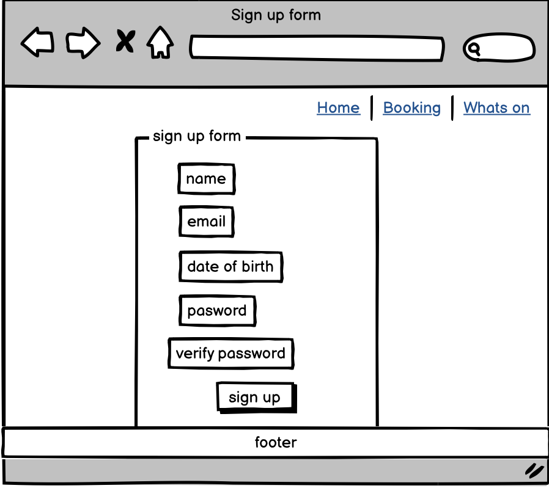
 | 
| login         | 

image
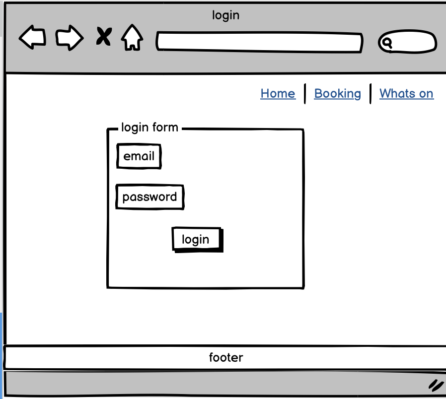
 | 
|  Events          | 

image
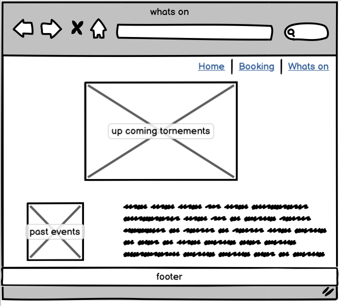
 | 

[Entity-Relationship Diagram](documentation/erd.png)
## DATA MODELS
CustomUser Model
| Name          | Field Type    |
| ------------- | ------------- | 
|    full_name  | CharFeild     | 
|    email  |  EmailField    |
|    membership_id  |  CharFeild  |
|   is_membership_approved  |   BooleanField  |
|   membership_start_date  |   DateField  |
|   membership_end_date  |   DateField  |
---
Booking Model
| Name          | Field Type    |
| ------------- | ------------- | 
|   User  | ForeignKey   | 
|    booking_time| TimeField    |
|    booking_date | DateField  |
|   booking_end_time |  TimeField     |
|    is_cancelled  |  BooleanField     |
|  is_edited  |    BooleanField |
|  Table | ForeignKey    |

---
TimeSlots Model
| Name          | Field Type    |
| ------------- | ------------- | 
|   day  |  CharFeild  | 
|   start_time| TimeField    |
|   is_open | BooleanField|
|   Table |    ForeignKey    | 
---

Table Model
| Name          | Field Type    |
| ------------- | ------------- | 
|  table_number  |  IntegerField | 
|   table_size|  CharFeild   |
|   booking_time| TimeField |
|  booked_start_time |  DateTimeField   |
|  booked_end_time |  DateTimeField   | 
|  booking_date |  DateField   |  

---

Post Model
| Name          | Field Type    |
| ------------- | ------------- | 
|   title  | CharFeild   | 
|   slug|   SlugField  |
|    author | ForeignKey |
|   content|  TextField     |
|   status  |  IntegerField |
|  created_on  |  DateTimeField    |
|  updated_on|   DateTimeField |
| featured_image  |   CloudinaryField |
|   likes|   ManyToManyField |

---
 Comment Model
| Name          | Field Type    |
| ------------- | ------------- | 
|    post | ForeignKey    |
|    name  |  CharFeild  | 
|    email  |  EmailField    |
|   body |   TextField  |
|  created_on  |  DateTimeField    |
|   approved  | BooleanField   |

---
# User Experience UX
----
Vistors to this site would be of the most part member of The Pool Hall Club They would be register on this app so they can make a booking for a table at the club and find information on Club events and news.

## Epics
This project was do in 5 epics, each epic has a list of user stories.

### [Epic 1](https://github.com/EdelCorbett/the-pool-hall/milestone/3) Basic System setup
Create the basic structure for a Django project                                              
### User Stories
- [As a Developer I can setup a project so that begin project.](https://github.com/EdelCorbett/the-pool-hall/issues/10)
- [As a Developer I can create a database so that store project](https://github.com/EdelCorbett/the-pool-hall/issues/11)
- [As a Developer I can Deploy project early so that I can continually test the application during development.](https://github.com/EdelCorbett/the-pool-hall/issues/12)

### [Epic 2](https://github.com/EdelCorbett/the-pool-hall/milestone/1) User registertion
This epic focuses on establishing a secure and user-friendly system for members to join and access the website's features and providing a secure and efficient authentication system for existing members.
### User Stories

- [As a Developer I can an Admin Site so that the site can be updated by the Admin](https://github.com/EdelCorbett/the-pool-hall/issues/14)
- [As a user I can create an account so that Register](https://github.com/EdelCorbett/the-pool-hall/issues/1)
- [As a user I can login so that I can book table.](https://github.com/EdelCorbett/the-pool-hall/issues/2)
- [As a Admin I can view memberships so that I can manage them](https://github.com/EdelCorbett/the-pool-hall/issues/9)
- [As an admin I can login so that I can view and manage bookings](https://github.com/EdelCorbett/the-pool-hall/issues/7)

### [Epic 3](https://github.com/EdelCorbett/the-pool-hall/milestone/2) Booking and Cancellation
In this epic a booking form will be created and the user ability to cancel a booking.
### User Stories

- [As a users I can choose time so that make a reservation.](https://github.com/EdelCorbett/the-pool-hall/issues/3)
- [As a User I can edit my booking so that change the date or time.](https://github.com/EdelCorbett/the-pool-hall/issues/15)
- [As a user I can access booking so that cancel my booking.](https://github.com/EdelCorbett/the-pool-hall/issues/4)

### [Epic 4](https://github.com/EdelCorbett/the-pool-hall/issues/5) Design
In this epic the design of the project is to make navigation  of site and design for user experience
### User Stories
- [As a User I can navigate to site easily so that find what I'm looking for.](https://github.com/EdelCorbett/the-pool-hall/issues/5)
- [As a User I can clearly determine what each form is for so that correctly fill them out.](https://github.com/EdelCorbett/the-pool-hall/issues/18)
- [As a developer I can create a favicon so that so user can locate page tab easy](https://github.com/EdelCorbett/the-pool-hall/issues/17)
- [As a Developer I can design a clear footer with social link and business informationso thatThe user can use link and find business info easy](https://github.com/EdelCorbett/the-pool-hall/issues/19)
### [Epic 5](https://github.com/EdelCorbett/the-pool-hall/milestone/5) Admin and Blog page
In this epic a blog page is create so admin can create post on events and club news and where users can comment and like the posts. This Feature was added later in the projectas it a good feature so the user can be kept up to date on club events.
### User Stories
- [As a user I can view up coming events so that I know whats coming up and i can comment and like the posts](https://github.com/EdelCorbett/the-pool-hall/issues/6)

---
# CRUD
## Create  
- The user can create an account
- The user can create a booking 
- The user can create a comment 
- Admin can create members
- Admin can create blog post 
- Admin can create bookings  
## Read 
- The user can read their bookings 
- The user can read the blog page 
- The user can read thier comments
- Admin can read comment  

## Update 
- The user update thier booking 
- The user can update their comment 
- Admin can update post 

## Delete
- The user can cancel thier booking 
- The user can delete their comment
- Admin can delete post 
- Admin can delete comments 
- Admin can delete members 

# Features  

Click to display screenshot of Pages

----

Home Page  logged out User

If user is not logged-in Home page displays register button and login button so users can register or login.

Home Page  logged in User

When User is logged in the home page display Book Now button is is because only login registered members can make a booking. 

----

Sign Up form

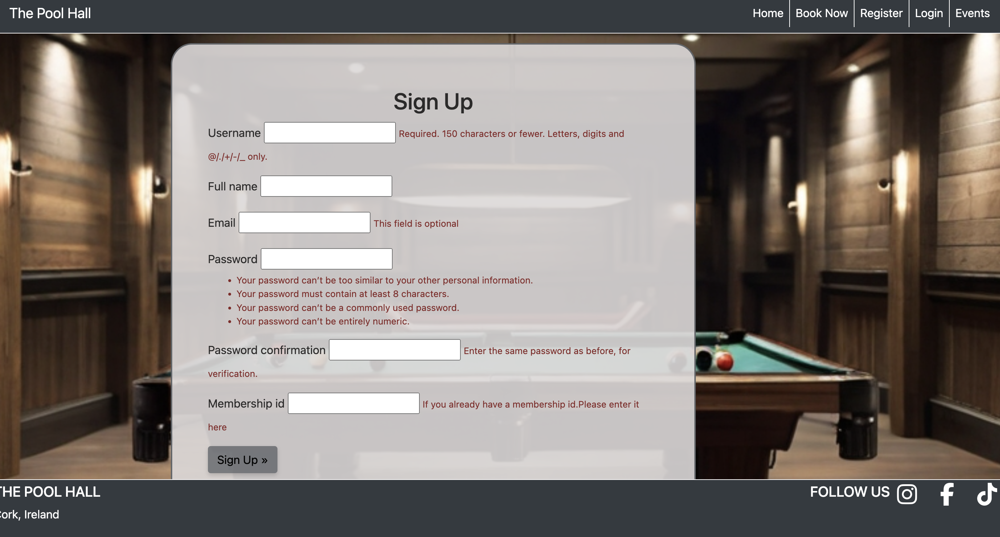

If Register button is clicked signup form is displayed, Django Allauth signup form is used for authentication.If user is already a member they can enter their membership Id if they don't enter a membership number one is generated when they register.

---

Sign in form

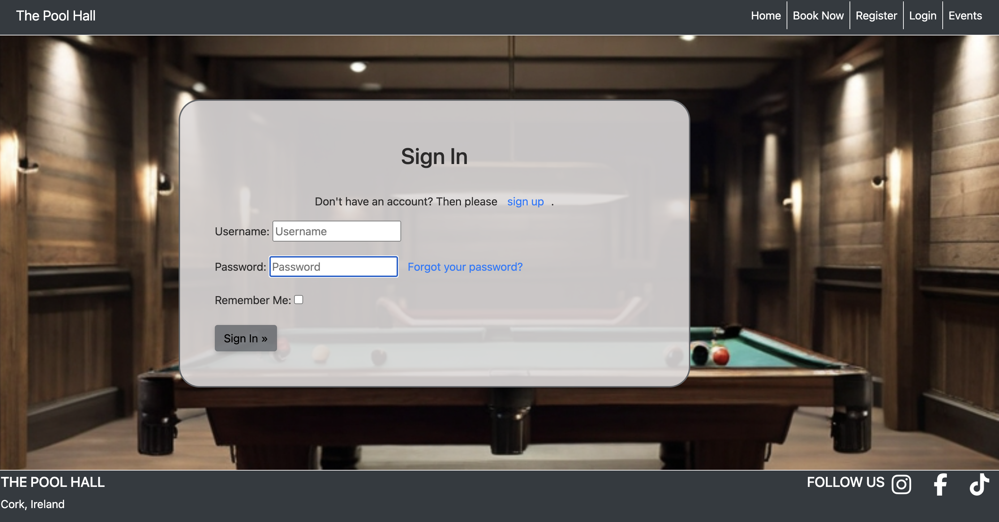

If user clicks login then sign in form is displayed,Django Allauth login form is used for authentication.When signed in successfully signed in message displays 

Sign in success

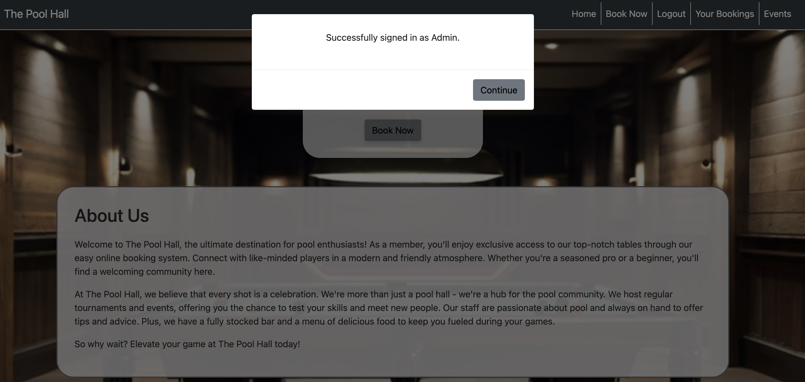

---

Sign out form

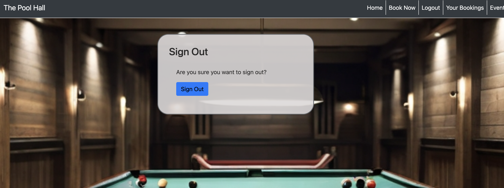

---
When user click logout sign out message and button is displayed if use clicks sign out then user is sign out and signed out message displays.

Sign out success

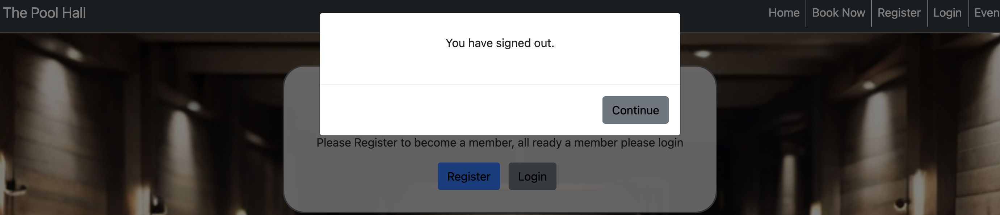

---

Book Now Form Page

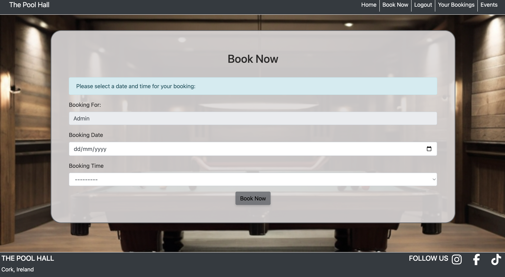

When user click Book Now booking for displays,the booking form is pre filled with login username which can not be changed as only approved members can make bookings.

Booking Date picker 

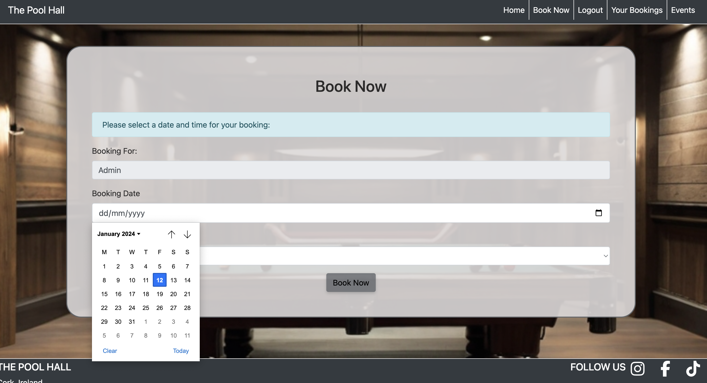

For Booking date a date picker will display to input date.

Booking Time 

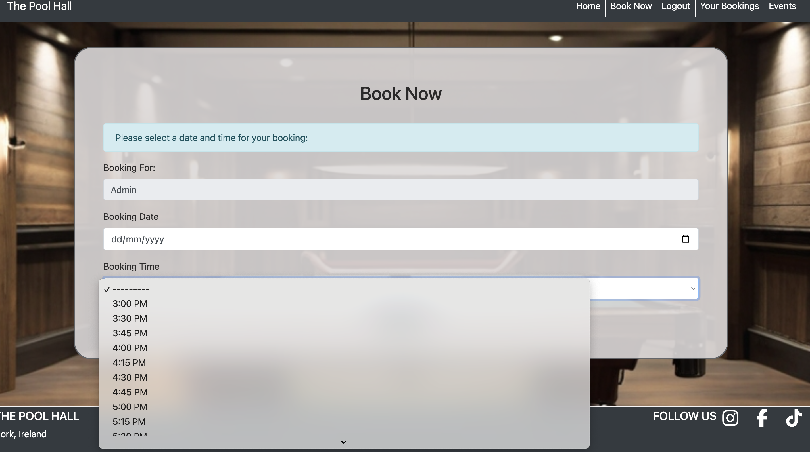

For Booking Time a list for time option will display.

---

Successfull Booking 

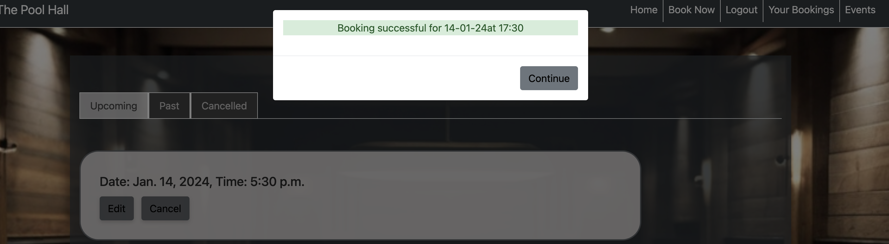

If Booking is successful success message will display with time and date of message and redirect to your bookings page.

Invalid Date or Time 

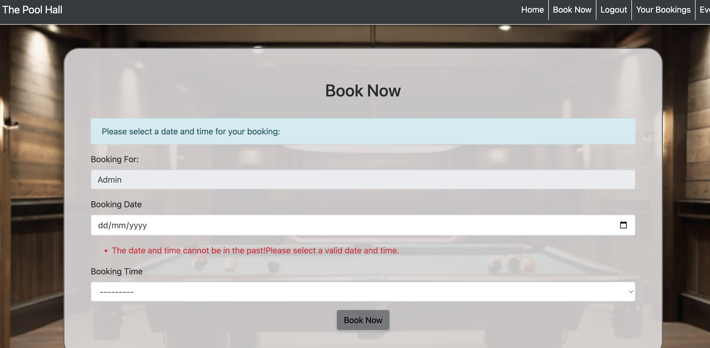

If invalid Date or time is chosen a errror message is displayed.

No Tables Available 

If there are no tables available for user selected date and time an alert message is displayed.

---

Your Bookings page Upcoming

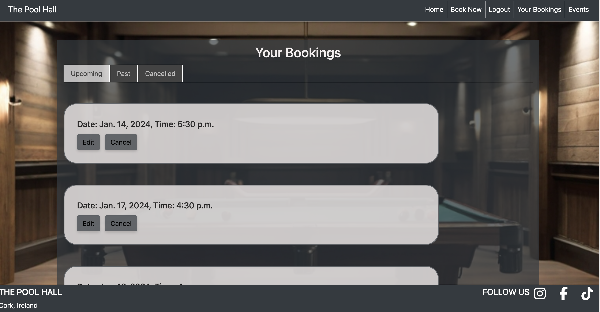

Your Bookings is a page where users can view all thier bookings Upcoming tab displays all upcoming bookings with an Edit button so users can edit thier booking and a cancel button so users can cancel thier booking.

Edit Button

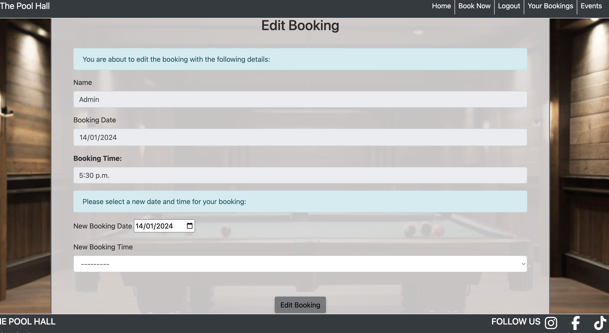

When edit button is clicked the Edit booking form is displayed.Edit booking form has the same date picker and time option as the booking form, it also give the same error messages for invalid date and time It also give the same alert as booking form if no tables are available of selected time and date.

Edit Successful

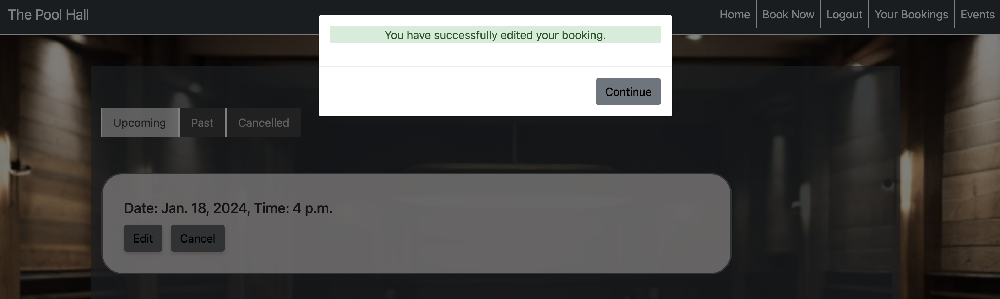

If Edit booking is successful a success message is displayed.

Cancel Button

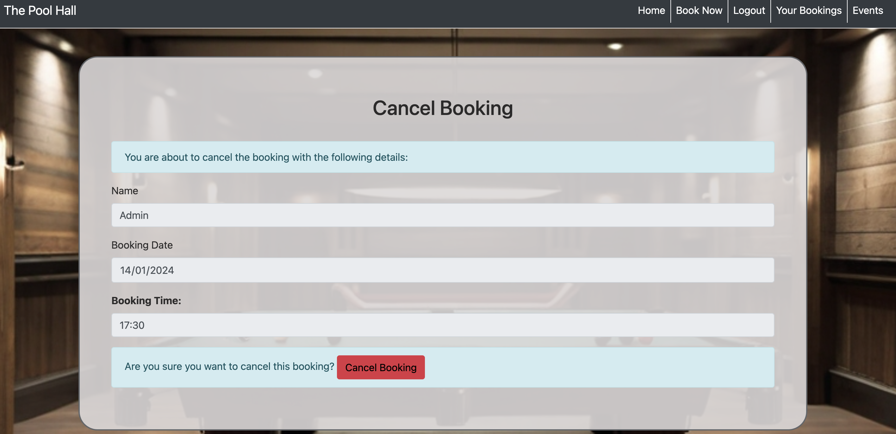

If cancel button is clicked it displays the cancel booking form here the user is ask are they sure they want to cancel the booking.If Cancel booking button is clicked booking is cancelled and a successfully cancelled message is displayed.

Successfully Cancelled

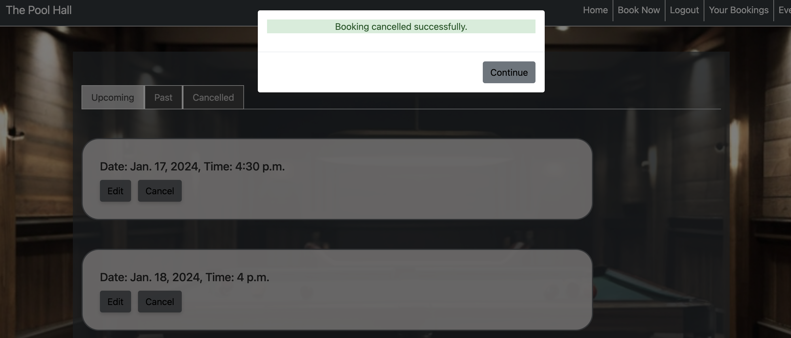

---

Your Bookings Past Tab 

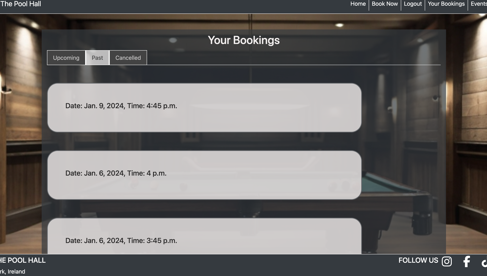

The past tab displays all past booking.

Your Bookings Cancelled Tab 

The cancelled tab displays all cancelled bookings.

---

Events Page 

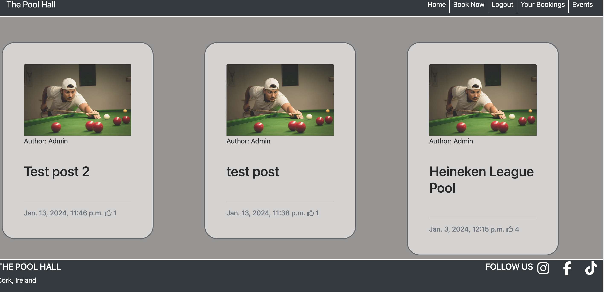

This is the blog page that displays the post, posted by Admin

Post Page 

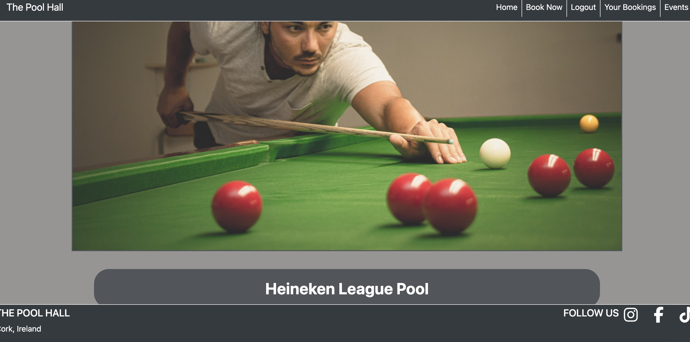

On this page users can view the post they can also like and comment on the post

leave comment 

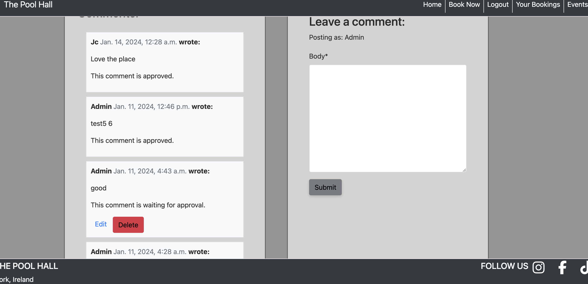

Here the user can leave a comment while their comment is waiting approval from Admin they have the option to edit or delete the comment once commet is approved it can not be edit or deleted.There is a message on each comment letting the user know if a comment is approved or if its still waiting approval.

---

### Navigation bar
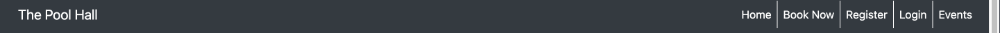
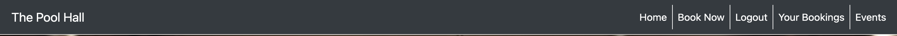
On large screens navbar has tabs for each page.
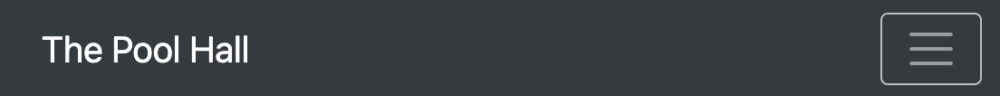

On Mobile the navbar use bootstrap to collapse down to a hamburger icon when clicked a drop down menu with link is displayed
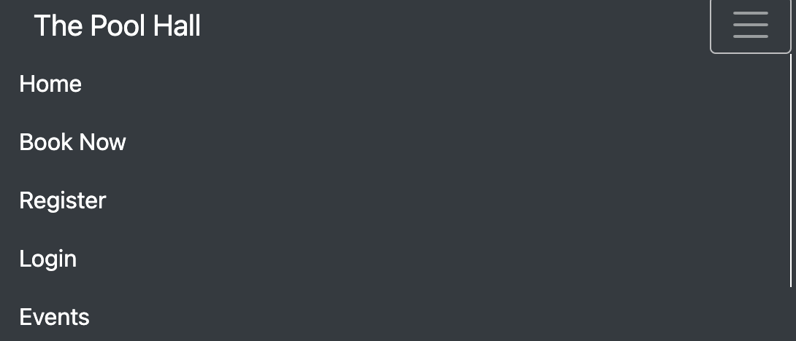

## Color Palette
This color palette was chosen as it compelmented the Background image 
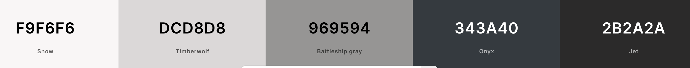
---
### Background image was generated using  [Leonardo.ai](https://leonardo.ai/)
 

# Admin Panel
Im the Admin panel the Staff can
- Approve and delete Memberships 
- Approve and delete comments
- Create ,veiw and detele bookings
- Create and delete Posts

# Deployment
This Project was deployed through [HEROKU](https://www.heroku.com/) using these steps:

1. Create a Heroku account 
2. Then select New
3. [Select Create new app](documentation/heroku-new.png)
4. Name the App, select region
5. [Select Create app](documentation/name_region.png)
6. [Then select Settings from the menu bar](documentation/setting.png)
7. [From here scroll down to Config Vars and the KEY and VALUE to the list](documentation/config.png)
8. [Next add build packs for this project Python was used](documentation/build_pack.png)
9. [Then go to Deploy in the menu bar](documentation/deploy.png)
10. [Choose GitHub then choose connect to github](documentation/deploy-method.png)
11. [Now enter repository name in search](documentation/name.png) 
12. [Then click connect](documentation/connect.png)
13. [From here scroll down and pick either automatic Deploy or manual deploy](documentation/update-deploy.png)
14. [The app is now been built](documentation/building.png)
15. [Once this has finished click view to go to app](documentation/deployed_success.png)

---

## Local deployment

1. Clone the repository.

 - https://github.com/EdelCorbett/the-pool-hall

 2. Set up a virtual environment.

- Use the command 

        python3 -m venv venv 
        
   to create a new virtual environment named 'venv'.
- Activate the virtual environment with 

        source venv/bin/activate.

3. Install necessary packages.
 Then Run

        pip install -r requirements.txt 
        
        
   to install the dependencies required for the project.

 4. Create a env.py file.

 5.

 - Import the os module with import os.
 - Set your secret key with os.environ["SECRET_KEY"] = 'your secret key'.
 - Provide the database URL with os.environ["DATABASE_URL"] = 'your database url'.
- Provide Cloudinary URL with
os.environ["ClOUDINARY_URL"] your database url.

6. In settings.py File
 - Specify the debug mode ["DEBUG"] = 'True' or 'False'.
- Define the allowed hosts with os.environ["ALLOWED_HOSTS"] = 'app name.herokuapp.com','localhost'.
- Add  to installed apps
 

6. Set up and configure the database.

- Create the database
- Apply migrations to the Database 

- In terminal first run 

        python manage.py makemigrations

    Then Run
    
        python manage.py migrate

7. Create the superuser.

    In terminal
    
       python manage.py createsuperuser

8. Then you be promted to enter a user name and password once this is done

        python manage.py runserver

### Setting Up a Database with ElephantSQL

1. Go to [ElephantSQL website](https://www.elephantsql.com/) and register for a new account.

2. Once registered, create a new database instance.

3. Assign a unique name to your database and opt for the free tier plan.

4. Proceed by clicking on "Select Region".

5. Choose a region that is close to you 

6. Review your selections by clicking on "Review".

7. Create your new database instance by clicking on "Create Instance".

8. Access your new database by clicking on its name, which will take you to the dashboard.

9. In the dashboard, you'll find the URL for your database. You'll need this URL to connect your Django project to the database.

# Technologies And Languages

## Languages 

- [HTML](https://html.com/)
- CSS
- [JavaScript](https://www.javascript.com/)
- [Bootstrap](https://getbootstrap.com/docs/4.0/getting-started/introduction/)
- [Python](https://www.python.org/)
- [Django](https://www.djangoproject.com/)
---
## Imported Modules
- [Django-allauth](https://pypi.org/project/django-allauth/) authentication library used to create the user accounts.

- [Gunicorn](https://pypi.org/project/gunicorn/)  web server used to run the website

- [Cloudinary](https://pypi.org/project/cloudinary/1.27.0/)

- [Django-crispy-forms](https://django-crispy-forms.readthedocs.io/en/latest/)

- [Dj-database-url](https://pypi.org/project/dj-database-url/)

- [Psycopg2](https://www.psycopg.org/)

---
## Technologies Used
 - [Techsini.com](https://techsini.com/multi-mockup/index.php)
 - [ElephantSQL website](https://www.elephantsql.com/) 
 - [VS Code](https://code.visualstudio.com/)
 - [Balsamiq](https://balsamiq.com/)
 - [Favicon](https://favicon.io/)
 - [GitHub](https://github.com/) 
---
# Testing 
All Testing in
[TESTING.md](./TESTING.md)
---
## Credits 
* [Code Institute](https://codeinstitute.net/) I think Therefore i blog walk through project for the blog page.
* [Very Academy](https://www.youtube.com/@veryacademy) tutorials for understanding of django
* [Codemycom](https://www.youtube.com/@Codemycom) tutorials for understanding of django
* [Pixbay](https://pixabay.com/)  Place holder Image
* [Font awesome](https://fontawesome.com/): social icons
* [Coolors](https://coolors.co/) generate color palette

## Acknowledgements 
I would like to acknowledge 
* [Code Institute](https://codeinstitute.net/)
* Juliia Konn My Mentor for her advice and support during the project.
* My Family members who help me test the app 
* This project was built for educational purposes by Edel Corbett  