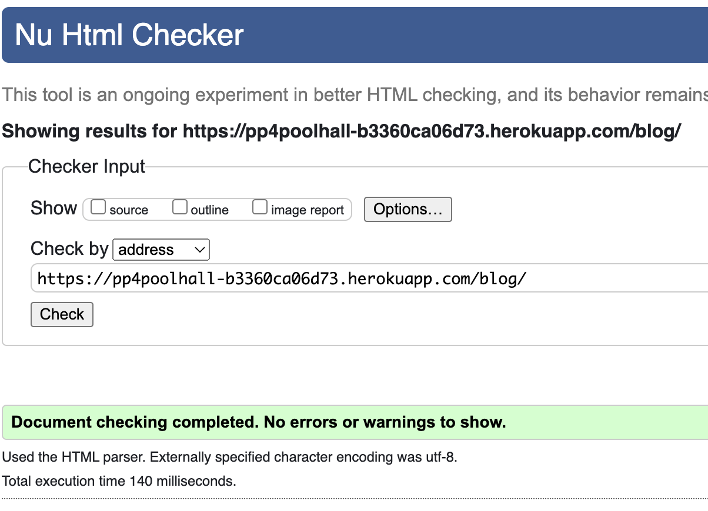
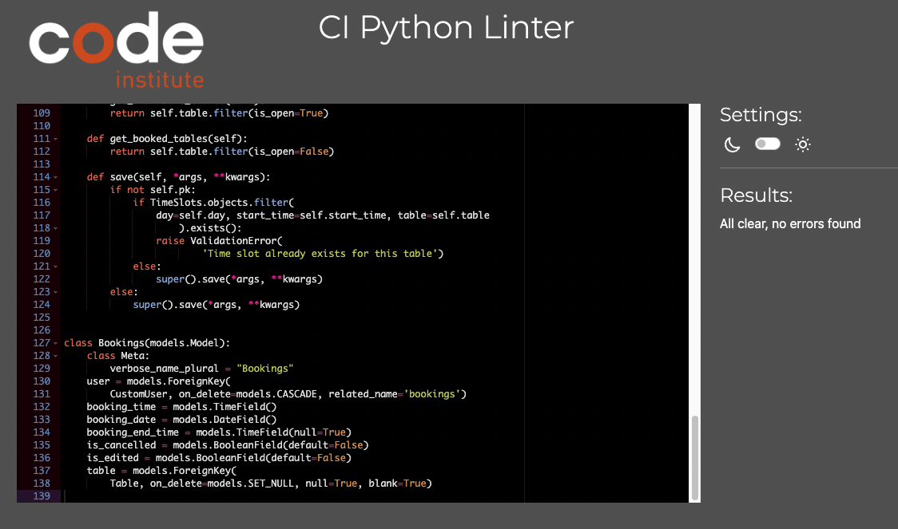

## Manual Testing
Browsers and Devices
* I have tested the site  on Chrome, Safari and Firefox
* I have tested the site on different screen sizes to confirm it is responsive mobile, Ipad and Desktop 
* I have tested all links to confirm they are functioning.
### Navigation Bar
| Feature               | Action     | Expected Result                                                    | Pass/Fail |
|-----------------------|------------|--------------------------------------------------------------------|-----------|
|  Logo                 | Click      |  Redirects to home page                                            |    Pass   |
|  Home Button                 | Click      |  Redirects to home page                                            |    Pass   |
|  Book Now                | Click      |  Opens to booking form page                                            |    Pass   |
|Register                 | Click      |  Opens signup form  page                                            |    Pass   |
|  Login                 | Click      |  Opens sign in form page                                            |    Pass   |
|  Events                | Click      |  Opens Blog Events page                                            |    Pass   |

### Footer 
| Feature               | Action     | Expected Result                                                    | Pass/Fail |
|-----------------------|------------|--------------------------------------------------------------------|-----------|
|  Instagram icon     | Click      |  opens Instagram                                                  |    Pass   |
|  Facebook icon     | Click      |  opens Facebook                                                 |    Pass   |
|  TicToc icon     | Click      |  opens Tictoc                                                  |    Pass   |
### Sign up Page
| Feature               | Action     | Expected Result                                                    | Pass/Fail |
|-----------------------|------------|--------------------------------------------------------------------|-----------|
|   Register button   | Click      |  Open Sign up form                                                |    Pass   |
|  User name  field   | Empty    |  Form won't submit error Displayed                                               |    Pass   |
|  User name  field   | Worng format entered    |  Form won't submit error Displayed                                               |    Pass   |
|  User name  field   | Duplicate Name   |  Form won't submit error Displayed                                               |    Pass   |
| Email  field (optional)  | Empty    |  Form submitted                                             |    Pass   |
| Email  field (optional)  | Worng format entered     |  Form won't submit error Displayed                                              |    Pass   |
| Email  field (optional)  |  Duplicate Email |  Form won't submit error Displayed                  |    Pass   |
| Email  field (optional)  | With correct format  |  Form submitted                                             |    Pass   |
| Password  field  | With incorrect format  |  Form won't submit error Displayed                                             |    Pass   |
| Password Confirmation field  | With incorrect Match  |  Form won't submit error Displayed                                             |    Pass   |
| Password  field  | With correct format  |  Form submitted                                             |    Pass   |
| Membership id field (optional) | Empty |  Submit form                                            |    Pass   |
| Membership id field (optional) | With correct format  |  Submit form                                            |    Pass   |
|  Sign Up button   | Click      |  Submit form and displays success login message                                              |    Pass   |
|  Contuine button on success message   | Click      |  redirects to home page message                                             |    Pass   |

### Home Page
| Feature               | Action     | Expected Result                                                    | Pass/Fail |
|-----------------------|------------|--------------------------------------------------------------------|-----------|
|  Register Button      | Click      |  Open Sign up page                                                 |    Pass   |
|  Login  Button        | Click      |  Opens login page                                                  |    Pass   |

### Booking Page
| Feature               | Action     | Expected Result                                                    | Pass/Fail |
|-----------------------|------------|--------------------------------------------------------------------|-----------|
|  Booking for:     | Try edit name      |  Read only can not be edited     |    Pass   |
|  Booking Date      | Click      |  Open Date picker      |    Pass   |
|  Booking Date      | Select Date      |  Fills input with selected date   |    Pass   |
|  Booking Time      | Click      |  Open time options      |    Pass   |
|  Booking Time      | Select time      |  Fills in with selected time      |    Pass   |
|  Booking past date      | Select date in the past      |  Raise Validation error      |    Pass   |
|  Booking past time      | Select time in the past      |  Raise Validation error      |    Pass   |
|  Booking Now Button      | Click      |   If booking is successful Opens Your bookings page and displays success message in modal       |    Pass   |

### Your bookings

| Feature               | Action     | Expected Result                                                    | Pass/Fail |
|-----------------------|------------|--------------------------------------------------------------------|-----------|
|  Upcoming Bookings Tab     | Click      |   Show list of upcoming booking with edit and cancel button      |    Pass   |
|  Edit Button      | Click      |   Opens Edit booking form page       |    Pass   |
|  Name     | Try edit name      |  Read only can not be edited     |    Pass   |
|  Booking Date     | Try edit Date      |  Read only can not be edited     |    Pass   |
|  New Booking Date      | Select Date      |  Fills input with new selected date   |    Pass   |
|  New Booking Time     |  Click       |  display time options      |    Pass   |
|  New Booking Time      | Select time      |  Fills in with selected time      |    Pass   |
|  New Booking Time      | Select time      |  Fills in with selected time      |    Pass   |
|  New Booking past date      | Select date in the past      |  Raise Validation error      |    Pass   |
|  New Booking past time      | Select time in the past      |  Raise Validation error      |    Pass   |
|  Edit Booking Button      | Click      |   If booking is successful Opens Your bookings page and displays success message in modal       |    Pass   |
|  Cancel Button      | Click      |   Opens Cancel booking form page       |    Pass   |
|  Cancel booking form       | booking details Read only      |   booking  details not Editable      |    Pass   |
|  Cancel booking  Button      | Click      |   Cancel booking displays success modal and redirects to your bookings       |    Pass   |
|  Modal Continue Button      | Click      |   cancels Modal       |    Pass   |
|  Past Tab      | Click      |  Shows list of past bookings      |    Pass   |
|  Cancelled Tab      | Click      |  Shows list of Cancelled bookings      |    Pass   |

### Events Page
| Feature               | Action     | Expected Result                                                    | Pass/Fail |
|-----------------------|------------|--------------------------------------------------------------------|-----------|
|  Blog post Link      | Click      |  Opens Post_detail Page     |    Pass   |

### Post_detail Page
#### If user is login
-----
| Feature               | Action     | Expected Result                                                    | Pass/Fail |
|-----------------------|------------|--------------------------------------------------------------------|-----------|
|  Like button      | Click      |  likes post and show how many likes are on post     |    Pass   |
|  Comment Icon      | show how many comment      |  Changes when new comment is approved    |    Pass   |
|  Leave a comment box      | write comment to post      |  prepopulate with poster name      |    Pass   |
|  Submit button      | Click      |  Submit post for Approval and displays waiting approval message    |    Pass   |
|  Comment waiting approval Edit Button     | Click      |   Display edit commet form   |    Pass   |
|  Save changes button      | Click      |  Submit Edit comment for approval and redirects to post page    |    Pass   |
|  Delete  button      | Click      |  Displays Delete comment modal    |    Pass   |
|  Delete  button on modal      | Click      |  Deletes comment displays home page  |    Pass   |
|  Cancel button on modal      | Click      |   Cancels modal displays post page |    Pass   |
#### If user is not login
-----
| Feature               | Action     | Expected Result                                                    | Pass/Fail |
|-----------------------|------------|--------------------------------------------------------------------|-----------|
|  Displays post      | none     |  Display post and approved comment.     |    Pass   |

---
## Validator Testing
### [W3C](https://validator.w3.org/) was used for validation of Html And CSS
---
## Html

## CSS

### [CI Pythoon linter](https://pep8ci.herokuapp.com/) was use to test python code.

| Poolhall project file                   |    Result    | 
|-----------------------------|------------|
| 

Settings.py

             | These errors are django set up code.   |
| 

urls.py

             | No errors   |
|

views.py

             | No errors   |
|

wsgi.py

             | No errors   |
|

asgi.py

             | No errors   |

---
| Booking App file                   |    Result    | 
|-----------------------------|------------|
|

admin.py

             | No errors   |
|

apps.py

             | No errors   |
|

forms.py

             | No errors   |
|

models.py

             | No errors   |
|

urls.py

             | No errors   |
|

views.py

             | No errors   |

----
| Blog App file                   |    Result    | 
|-----------------------------|------------|
|

admin.py

             | No errors   |
|

apps.py

             | No errors   |
|

forms.py

             | No errors   |
|

models.py

             | No errors   |
|

urls.py

             | No errors   |
|

views.py

             | No errors   |

---
### Lighthouse

Click to display screenshot results for lighthouse testing

----
| PAGE                  |    Result    |
|-----------------------------|------------|
|  Home          | 

mobile

 | 
|  Home          | 

desktop

 |
|  Booking         | 

mobile

 | 
|  Booking         | 

desktop

 |
|  Sign up  | 

mobile

 |  
|  Sign up         | 

desktop

 |
|  Sign In | 

mobile

 |
|  Sign In         | 

desktop

 | 
|  Bookings | 

mobile

 |
|  Bookings | 

desktop

 |
|  Events | 

mobile

 |
|  Events | 

desktop

 |
|  Post page | 

mobile

 |
| Post page | 

desktop

 | 
|  Edit comment page| 

mobile

 |    

### BUGS
- [Deploying to Heroku](https://github.com/EdelCorbett/the-pool-hall/issues/13)

- [Failed deployment](https://github.com/EdelCorbett/the-pool-hall/issues/20)

- [Duplicate comment](https://github.com/EdelCorbett/the-pool-hall/issues/21)